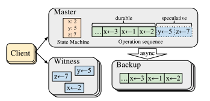

# Exploiting Commutativity For Practical Fast Replication

### Motivation:

Replication protocols must typically guarantee the following two properties: 

* **Consistent Ordering:** if a replica completes operation a before b, no client in the system should see the effects of b without the effects of a.\*
* **Durability**: once its completion has been externalized to an application, an executed operation must survive crashes.

To achieve both properties, existing works either need 2 RTTs\(e.g. Primary-backup\) or requires special hardware support\(e.g. Network-Ordered Paxos\). 

\*Similar to the guarantee of total ordering delivery protocol, which says that for any message a, b and any process p, q, if p delivers a then b, so does q. 

### Summary:

This paper introduces Consistent Unordered Replication Protocol\(CURP\) that, in most cases, completes linearizable deterministic update operations within 1 RTT without special networking. The key idea behind CURP is to separate durability and consistent ordering, so update operations can be done in 1 RTT in normal cases. In addition to sending the update to the master, the client also sent their request in temporary storage, called a _witness\[1\]_. Master will replicate ordered data to backups asynchronously. 

To ensure the ordering guarantee, CURP uses commutativity: all of the unsynced\(speculative\) requests  must be commutative. CURP is able to detect and filter-out duplicate requests.

**Execution Overview:**

The client will send the request\[2\]to the master and all witnesses. In best case scenario, if the request are commutative with all unsync operations, the client will get unanimous acknowledgements, meaning that the request is complete in 1 RTT. However, if they do not commutative or some of the witnesses failed, the client must ask the master to synchronize with all backups. This waiting for sync increases the operation latency to 2 RTTs in most cases and 3 RTT in worst case. 

\[1\] There will be f witnesses and f backups, where f is typically set to 3 

\[2\] Request includes both read and write. However, the witnesses only record the writes.

### Comments:

I like the idea of utilizing commutativity to minimize the synchronization between the master and backups. In addition, the authors did a great job explaining the system. \(In my opinion, one of the factors to determine a good system paper is the difficulty of the reader to re-implement it.\) 

However, I have some concerns/questions: 1. The idea of exploring commutativity in distributed computing is not new. For example, [CRDTs](https://hal.inria.fr/inria-00555588/document) and [CALM](https://rise.cs.berkeley.edu/blog/an-overview-of-the-calm-theorem/) utilized communitativity. I think the paper should discuss how their approach is different from such previous works. 2. I think the two requirements\(consistent ordering and durability\) are not accurate. Replication protocols should be able to guarantee linearizability, which is not the same as consistent ordering. 3. They do not have a clear definition about communitativity. i.e. what operations are commutative. 4. How do you handle "stragglers"? That is, how do you handle slow witnesses?

