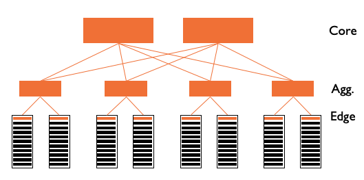
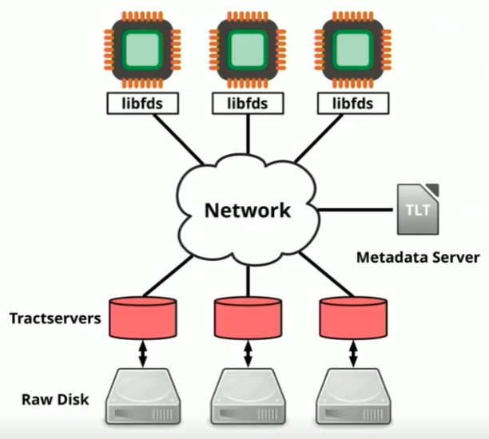
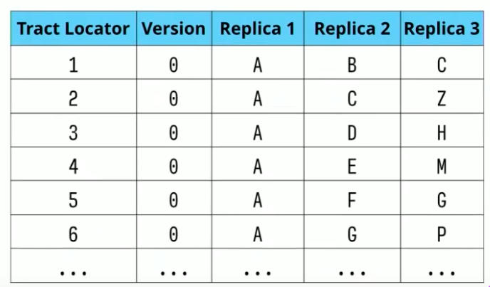
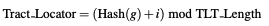

# Flat Datacenter Storage

### Summary - What is FDS?

Flat Datacenter Storage\(FDS\) is a cluster storage system that stores giant binary large objects\(blobs\)\(i.e., multi-megabyte content\). All clients and servers are connected by full bisection bandwidth networks. It is used for big-data processing frameworks\(e.g., MapReduce\), where a cluster of 1000s of computers processing data in parallel.

### Background and Motivation

**Oversubscription**

Switch ports and cabling have both monetary cost and an operational cost in data centers. Imagine you have to wire 1000s machines together. How would you do it? The following figure shows the dominant design pattern for data-center architecture today\(2012\). 

As shown in the above figure, the network is a tree-like hierarchy reaching from a layer of servers in racks at the bottom to a layer of core routers at the top. Orange rectangles represent switches. Unfortunately, this conventional design suffers from a fundamental limitation: **Limited server-to-server capacity\(i.e., oversubscription\).**

As we go up the hierarchy, we are confronted with steep technical and financial barriers in sustaining high bandwidth. Thus, as traffic moves up through the layers of switches and routers, the over-subscription ratio increases rapidly. Top-level switches can be oversubscribed by greater than 1000x, meaning that only one in 1000 machines can send data across the top level to the other side at a time. 

This [paper](https://web.eecs.umich.edu/~mosharaf/Readings/VL2.pdf) provides more detailed explanation. 

#### Disk Locality

The conventional wisdom in big-data processing systems\(e.g., MapReduce\) is to move computation to the data\(i.e. respect data locality\) because of the problem of oversubscription. Although some works\(e.g., [Delay Scheduling](http://elmeleegy.com/khaled/papers/delay_scheduling.pdf)\) try to solve this issue, location-awareness adds complexity to the scheduler. 

#### [CLOS network ](https://web.eecs.umich.edu/~mosharaf/Readings/VL2.pdf)

However, recently developed CLOS networks have made it economical to build non-oversubscribed full bisection bandwidth networks at the scale of a datacenter. 

The main consequence is that there is no distinction between local disk and remote disk, since the network bandwidth is roughly equal to the network bandwidth. \(However, note that memory bandwidth is still two orders of magnitude than the disk and network bandwidth\). Thus, we can have much simpler work schedulers and programming models. 

Another consequence of such design is that high disk-to-disk bandwidth can also facilitate fast recovery from disk and machine failures. 

### Architecture Overview

In FDS, data is logically stored in **blobs**, which is a byte sequence named with a 128-bit GUID. Reads from and writes to a blob are done in units called tracts. Empirically, they found that 8MB makes random and sequential access achieves nearly the same throughput. Every disk is managed by a process called a **tract server** that services read and write requests that arrive over the network from clients. FDS uses a **metadata server** to store the location of tracts.

#### API\(Figure 1\)

All calls\(read and write\) in FDS are atomic and non-blocking, which allows for deep pipelining. However, FDS provides weaker consistency guarantees, in which calls are not guaranteed to arrive in order of issue.

### Metadata Management

FDS uses a metadata server to store the information about data placement, but it only stores the tract locator table\(TLT\). Each TLT entry, with k-way replication, contains k tractservers. The client applies the following function to get entries in TLT, called **tract locator**. Once clients find the proper tractserver address in the TLT, they send read and write requests containing the blob GUID, tract number. 

Different from inode in UNIX, the TLT does not contain complete information about the location of individual tracts in the system.\(We will compare TLT against DHT and NameNode in Hadoop later\). The metadata about each blob is stored in its special metadata tract\("tract - 1"\). 

Note that TLT changes only in response to cluster reconfiguration or failures and is not modified by tract reads and writes. Thus, TLT entries can be cache by clients for a long time. 

### Dynamic Work Allocation

In FDS, since storage and compute are no longer colocated, the assignment of work to worker can be done dynamically, at fine granularity, during task execution. The best practice for FDS applications is to centrally \(or, at large scale, hierarchically\) give small units of work to each worker as it nears completion of its previous unit. Since,  in BSP, all tasks in the previous stage have to finish before the current stages begin, such design eliminates stragglers. 

### Replication and Recovery

#### Replication

FDS uses replication both for availability and fault tolerance. When an application writes a tract, the client library finds the appropriate row of the TLT and sends write to every tractserver it contains. Reads select a single tractserver at random. When a tract server receives create, extend or delete blob requests\(i.e. operations which modify the metadata tract\), it executes a two-phase commit with the other replicas. 

#### Recovery

Each TLT entry also has a version number, canonically assigned by the metadata server. When the metadata server detects a tractserver timeout, it declares the tractserver dead. Then, it invalidates the current TLT by incrementing the version number of each row in which the failed tractserver appears and picks random tractservers to fill in the empty spaces. Table versioning prevents a tractserver that failed and then returned. The paper provides more details and examples about the recovery protocol. 

### Compare to HDFS/GFS

Hadoop and GFS both have a centralized master that keeps all metadata in memory. Files and directories are represented on the master/NameNode by inodes, which record attributes like permissions, modification and access times, namespace and disk space quotas. Although such design provides one-hop access to the data and can recover from failure promptly, as the contents of the store grow, the master becomes a centralized scaling and performance bottleneck. 

In contrast, the tract locator table's size is determined by the number of machines in a cluster, rather than the size of its content.

