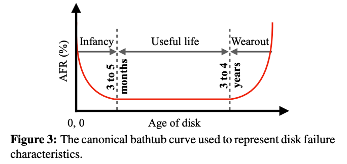

# Short Summaries

### [AdaptSize: Orchestrating the Hot Object Memory Cache in a Content Delivery Network](https://www.cs.cmu.edu/~harchol/Papers/NSDI17.pdf) - Berger et al., NSDI' 17

This paper inspects the caching mechanism of Content Delivery Networks\(CDNs\). A CDN server typically employs two levels of caching: a small but fast in-memory cache called Hot Object Cache\(HOC\) and a large second-level Disk Cache\(DC\). The goal of AdaptSize is to maximize the object hit ratio of HOC. 

The key insights are 1. the HOC is subject to extreme variability in request patterns and object size\( up to 9x difference\). As a result, not all objects should be admitted to the HOC and 2. existing works only focus on cache eviction and assume objects are of the same size. Based on these observations, the authors propose AdaptSize, which is a near-optimal method for size-aware cache admission. AdaptSize admits objects with probability $$e^{-size/c}$$ and evicts objects using a concurrent [variant](https://varnish-cache.org/trac/wiki/ArchitectureLRU) of LRU. As the optimal c changes over time, AdaptSize uses a Markov chain model to find the best c.

### [Pegasus: Tolerating Skewed Workloads in Distributed Storage with In-Network Coherence Directories](https://www.usenix.org/conference/osdi20/presentation/li-jialin) - Li et al., OSDI' 20

Many real-workloads are skewed and dynamic. This paper introduces a new system, called Pegasus, that leverages programmable switch ASICs to balance load across storage servers. The key observations are: 1\) the top-of-rack switch is on the path of every client request and server reply. and 2\) it is possible to achieve provable load balancing guarantees if we only replicate the most popular $$O(nlogn)$$ objects, where n is the number of servers. Thus, Pegasus uses a selective replication and in-network coherence directory approach. 

Thus, Pegasus uses a selective replication and in-network coherence directory approach. The ToR switch maintains the coherence directory; it stores the set of replicated keys, and for each key, a list of servers with a valid copy of the data. Pegasus selectively replicates popular objects and it decides which objects to replicate by tracking the access rate of each key and uses a lightweight version-based coherence protocol to ensure consistency\(linearizability\).

Pegasus can handle arbitrary object sizes, guarantee linearizability, and support any read-write ratio. The evaluation shows that Pegasus can increase the throughput by up to 10x or reduce by 90% the number of servers required and still satisfy a 99%-latency SLO.

### \*\*\*\*[**PACEMAKER: Avoiding HeART attacks in storage clusters with disk-adaptive redundancy**](https://www.usenix.org/conference/osdi20/presentation/kadekodi) ****- ****Kadekodi  et al., OSDI' 20

This a follow-up work of their HeART paper in FAST' 19. Storage clusters consist of heterogeneous disks with highly varying failure rates. HeART proposes that we should treat subsets of disks with different AFR characteristics differently. It adapts redundancy of each disk by observing its failure rate on the fly depending on its make/model and current age. The key idea is that we can reduce the redundancy level during the disks' useful life. 

However, such design is reactive, the data will continue to be under-protected until the redundancy scheme transition completes. This paper introduces PACEMAKER, which is a low-overhead disk-adaptive redundancy orchestrator. The key component is a proactive-transition-initiator, which determines when to transition the disk, and a transition executor, which determine how to transition the disks. PACEMAKER introduces two new approaches for changing the redundancy scheme to avoid the expensive reading-re-encoding-writing approach.

