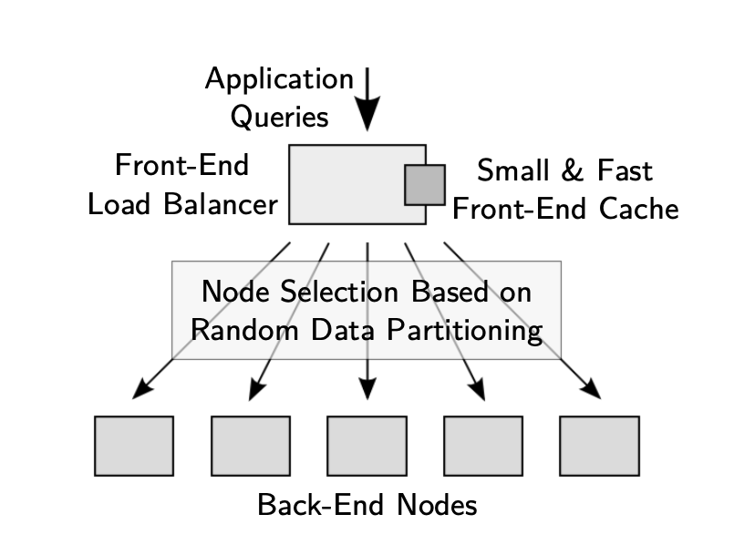

# Small Cache, Big Effect: Provable Load Balancing forRandomly Partitioned Cluster Services

### TL;DR

This paper shows that system designers can ensure load balancing for an important class of service using a popularity-based small front-end cache. The key observation is that **a skew in popularity harms load balance but simultaneously increases the effectiveness of caching**.

### Target Applications and motivation

The techniques of this paper target services with three properties: 1. Randomized partitioning 2. Cheap to cache results and 3. costly to shift service. Such applications include distributed file system\(e.g., GFS and HDFS\). distributed object caches\(e.g., Memcached\) and distributed key-value storage systems\(e.g., Dynamo\). 

The overall goal of this paper is to allow cloud service providers to meet SLOs for handling a particular rate of queries regardless of the query distribution, without the need for drastic over-provisioning. 

In the above applications, systems must balance both the **static** component of load—the constant storage or memory capacity required on individual nodes, which we typically refer to as the amount of data they handle—and the **dynamic** load of handling queries as they arrive. Data should be spread uniformly among nodes, and no node should handle too many more queries than another node. 

Capacity is typically load-balanced by striping deterministically \(e.g., RAID\) with carefully chosen boundaries for stripes, or by using a hashing-based approach\(e.g., consistent hashing\). However, these techniques do not balance the dynamic load: hotspot can still occur when some items are queried more than others. Existing systems typically balance dynamic load in two ways: 1. Move data from busy nodes to less busy nodes 2. Use some kind of "power of two choices"\(i.e., replication\). However, both is less-than-ideal since they introduce eider consistency and migration challenges or high space overhead for full replication.

### FAWN-KV\* 

A FAWN-KV cluster has one front-end node that directs queries from client applications to the appropriate back-end storage node by hashing the key being queried for\(FAWN uses consistent hashing\). All keys are stored on the back-end nodes. Ensuring load balancing only requires a relatively small cache. In addition, to achieve high throughput, the front-end cache must be fast enough to keep the cluster of nodes behind it busy. 

The paper proves that the cache need only store O\(nlogn\) entries to provide good load balance, where n is the total number of back-end nodes.

\*Note that the this project is not called FAWN-KV but it was built on top of FAWN-KV

