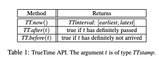
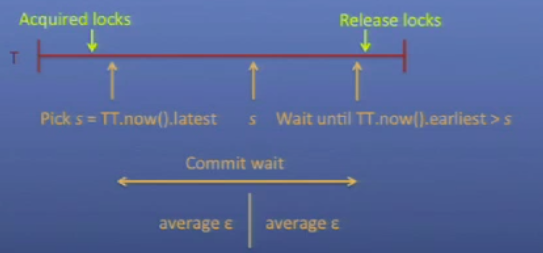

# Spanner: Google's Globally-Distributed Database

### Spanner in a Nutshell:

1. Lock-Free distributed read only transactions
2. External consistency of writes
3. Temporal multiple versioning
4. Schematized, semi-relational database with

   associated structured query language

5. Applications control replication and placement
6. All of this because of TrueTime

### [TrueTime](https://cloud.google.com/spanner/docs/true-time-external-consistency)

TrueTime is a global synchronized clock with bounded non-zero error: it returns a time interval that is guaranteed to contain the clock’s actual time for some time during the call’s execution. More specifically, Spanner provides the following APIs.

TrueTime is used by Cloud Spanner to assign timestamps to transactions and it allows Spanner provides external consistency, which is the strictest consistency property for transaction-processing systems. It is stated as following: For any two transactions, $$T_1 $$ and $$T_2 $$, if $$T_2 $$ starts to commit after $$T_1 $$ finishes committing, then the timestamp for $$T_2 $$is greater than the timestamp for $$T_1 $$.

\*\*\*Spanner is that it gets serializability from locks, but it gets external consistency \(similar to linearizability\) from TrueTime.

### Two Phase Commit in Spanner

As with most ACID databases, Spanner uses two-phase commit \(2PC\) and strict two-phase locking to ensure isolation and strong consistency. 2PC has been called [an “anti-availability” protocol](http://queue.acm.org/detail.cfm?id=2953944) because all members must be up for it to work. Spanner mitigates this by having each member be a Paxos group, thus ensuring each 2PC “member” is highly available even if some of its Paxos participants are down. Data is divided into groups that form the basic unit of placement and replication

**Note**: I'd like to point out that Google runs Spanner on its own private global network. Spanner is not running over the public Internet — in fact, every Spanner packet flows only over Google-controlled routers and links. Thus, it is infeasible to borrow the idea of TrueTime and implement something on your own. However, if you are unsatisfied with the logical clock and want to leverage physical clocks, there is something called [Hybrid Logical Clock](https://cse.buffalo.edu/tech-reports/2014-04.pdf), which provides a feasible alternative. As far as I know, HLC is implement in Dropbox's new Distributed File System and [CockroachDB](https://github.com/cockroachdb/cockroach/commit/aebb70b0d3e2f0a71e06cbedef45a4fd731f5367), an open source clone of Spanner.  

### References:

* [Presentation at OSDI12' ](https://www.usenix.org/node/170855)
* [Spanner, TrueTime & The CAP Theorem by Eric Brewer](https://static.googleusercontent.com/media/research.google.com/en//pubs/archive/45855.pdf) 

