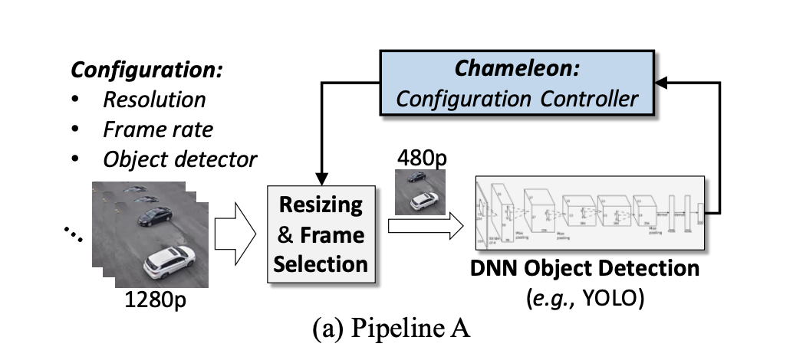
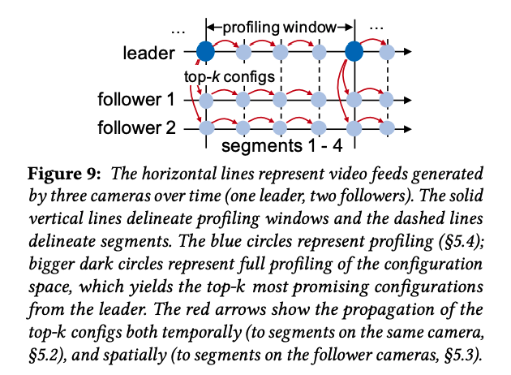

# Chameleon: Scalable Adaptation of Video Analytics

### Background

A typical video analytics application consists of a _**pipeline**_ of video processing modules. The pipeline has several '_**knobs**_' such as frame resolution, frame sampling rate, and detector model. A particular combination of knob values is referred as a _**configuration**_. 

For example, in pipeline A the raw video frames are first pre-processed by sampling frames and resize them, and are then fed into one of several pre-trained object detection models\(e.g., YOLO\). 

The choice of configuration impacts both the resource consumption and accuracy of the video application. For example, using high frame resolutions \(e.g., 1080p\) or NN models with many layers enables accurate detection of objects but also demands more GPU processing. Moreover, the best configuration for a video analytics pipeline also varies over time. For the traffic pipeline described above, we may use a low frame-rate during rush hours when cars are moving slowly. 

### Motivation

Prior video analytics systems profile the processing pipeline to minimize balance the resource and accuracy trade-off, but they only do it once. Specifically, they exhaustively profiles all configurations on the first x seconds of the video, picks the cheapest configuration that meets a predefined accuracy threshold, and stick with it for the whole duration of the video. However, as we hinted above, if the video content becomes more challenging\(e.g. traffic moves faster\), using the same configuration will negatively impact the accuracy. On the other hand, same configuration will waste resources if the video content is less challenging\(e.g. at a traffic stop\).

This limitation naturally leads us to periodically update the configurations\(i.e., every t seconds\). Unfortunately, profiling all configurations every T seconds is computationally prohibitive, which will negate the gains made by dynamically adapting the configuration.

### Key insights

#### Persistent characteristics over time

While the characteristics of videos change over time, the underlying characteristics of the video objects \(e.g., size, class, viewing angle\) that affect accuracy tend to remain relatively stable over time. As a result, the best top-k best configurations tend to remain stable over time. Thus, we can dramatically reduce the search space by focusing on these top-k configurations, while periodically explore the full configuration space. 

#### Cross-camera similarities

Video feeds that exhibit spatial correlations are abundant in practice. For example, the traffic cameras deployed in the same highway may be correlated, because the traffic tends to move in the same speed. Even if the cameras are not in geographic proximity, cameras deployed for the same purpose are also likely to exhibit similarities. We can leverage the fact that similar videos tend to have similar distributions of best configurations\(i.e. same top-k configurations\).

#### Independence of configuration knobs

The authors observed that, empirically,  individual knobs have independent impact on accuracy and cost. This observation lets us prune a large part of the configuration space, which significantly reduce the profiling cost.

### Chameleon

Chameleon periodically and profiles the video pipeline using an interval we refer to as the _**profiling window**_. Each profiling window is split into w smaller segments, each of which is a contiguous set of frames spanning a T-second interval. To leverage the temporal persistence, Chameleon only re-profile the configuration space on the first segment. 

A "leader" video is profiled at the start of a "profiling window" and a set of good\(top-k\) configurations is found. This set is shared among "follower" videos who are similar to the leader. The initial grouping is done via an algorithm which will use k-means on the accuracy results of the initial profiling step.

Chameleon uses a solution inspired by **greedy hill climbing** that exploits the independence of NN configuration knobs to reduce the search space from exponential to linear. In greedy hill climbing, each knob is tuned while all other knobs are held fixed, reducing the search space to linear. 

### Comment

The paper provides very a good discussion and future work section. 1. Besides computational cost, network bandwidth is one of the key challenges in video analytics. Each stream coming in may be several orders of magnitude larger than the available bandwidth. To this end, FilterForward is one of the recent work that tries to save bandwidth by carefully selecting the video frames sent to the server. 2. Chameleon's design relied on a separate cluster for its periodic profiling so as to avoid any disruptions to live video analytics. 3. Although not mentioned in the paper, I doubt that, similar to NoScope, Chameleon is designed for fixed angle cameras. Thus, I think it is an interesting future work to explore the world of moving cameras.

