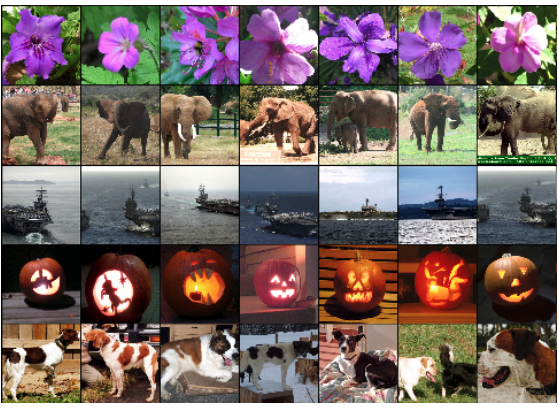
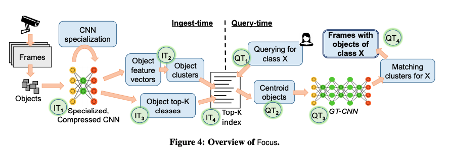

# Focus: Querying Large Video Datasets with Low Latency and Low Cost

### Motivation

Querying over large historical video datasets is an critical workload. Example queries include identifying video frames with objects of certain classes\(e.g., cars or pedestrians\). However, the state-of-the-art object detector\(e.g., YOLO\) requires approximately 200 hours to identify frames on a month-long traffic video. 

### Background

I really like section 2 of this paper. It provides some insights into my current project. 

* **Feature Vector in CNN**

The output of the last hidden layer can be considered as "representative features" of the input image.\(i.e. the feature vector\). It has been shown that if two images produce feature activation vectors with a small Euclidean separation, we can say that the higher levels of the neural network consider them to be similar.\[1\]. 

The above images show the six training images that produce feature vectors in the last hidden layer with the smallest Euclidean distance from the feature vector for the images in the first column. Notice that at the pixel level, the retrieved training images are generally not close in L2 to the query images in the first column. For example, the retrieved dogs and elephants appear in a variety of poses. 

* **Specialized CNN**

CNN specialization is a technique where the CNN are trained on a subset of a dataset specific to a particular context. Specialization simplifies the task of a CNN because specialized CNNs only need to consider a particular context. For example, differentiating object classes in any possible video is much more difficult than doing so in a traffic video, which is likely to contain far fewer object classes \(e.g., cars, bicycles, pedestrians\). As a result, specialized CNNs can be more accurate and smaller at the expense of generality. 

* **Compression**

Compression\(e.g. layers and matrix pruning\) is a set of techniques that can dramatically reduce the cost of inference at the expense of accuracy.\(e.g. ResNet18 vs. ResNet152\). Although cheap/compressed CNNs are generally less accurate than the original CNNs, the top-most output of the expensive CNNs for an object is often contained within the top-k classes output by the cheap CNN, for a small value of K. 

**Three key characteristics of real-world videos:**

* **large portions of videos can be excluded**
  * In the experiment datasets, an object class occurs in only 0.16% of the frames on average, and even the most frequent object class occurs in no more than 26%-78% of the frames. As a result, indexing frames using the object class is a promising approach to speed up queries. 
* **Only a limited set of object classes occur in each video**
  * Most video streams have a limited set of objects because each video has its own context. \(e.g., traffic cameras can have automobiles, pedestrians or bikes, but not airplanes\). 2% - 10% of the most frequent object classes cover over 95% of the objects in all video frames. This gives us an opportunity to train efficient CNNs specialized for these common classes.
* **Objects of the same class have similar feature vectors** 
  * Objects moving in the video often stay in frame for several seconds. Thus, we can find duplicate objects by using feature vectors and only classify one of them using a CNN. \(and apply the same label to all duplicates\). 

### Focus

The objective of Focus is to enable low-latency and low-cost querying over large historical datasets. 

At ingest-time, Focus classifies objects in the incoming video frames and extracts their feature vectors. For its ingest, Focus uses highly compressed and specialized CNN \(IT1\). Focus then clusters objects based on their feature vectors \(IT2\) and assigns to each cluster the top K most likely classes these objects belong to \(based on classification confidence of the ingest CNN\) \(IT3\). It creates a top-K index, which maps each class to the set of object clusters \(IT4\). The top-K index is the output of Focus’ ingest time processing of videos. 

At query-time, when the user queries for a certain class X \(QT1\), Focus retrieves the matching clusters from the top-K index \(QT2\), runs the centroids of the clusters through GT-CNN \(QT3\), and returns all frames from the clusters whose centroids were classified by expensive but accurate CNN as class X \(QT4\).

#### Trading off Ingest Cost and Query Latency

Focus automatically chooses the ingest CNN, its K, and specialization and clustering parameters to achieve the desired precision and recall targets. These choices also help Focus trade off between the work done at ingest-time and query-time. For instance, to save ingest work, Focus can select a cheaper ingest-time CNN, and then counteract the resultant loss in recall by using a higher K and running the expensive CNN on more objects at query time. \(See 4.4 for more details\). I found this part of the discussion very interesting.

### Comments:

I like the first two sections of this paper as it provides substantial background and motivation for this work. However, I found that the paper could be more organized for sections 3-5. Moreover, it's not clear to me, based on the paper, how Focus creates ingest-time CNN based on the input CNN.

### References:

\[1\] ImageNet Classification with Deep Convolutional Neural Networks - Krizhevsky et al.,

