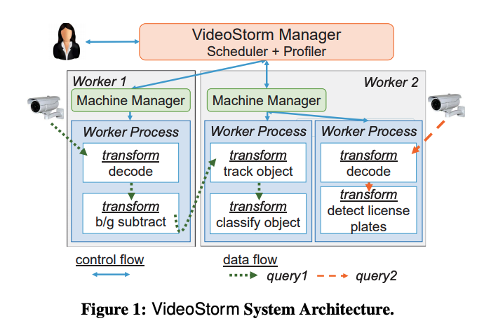

# Live Video Analytics at Scale with Approximation and Delay-Tolerance

### Motivation

This paper considers two key characteristics of video analytics: 1. the resource-quality trade-off with multi-dimensional configurations in video analytics. In other words, resource demand can be reduced by changing configuration knobs but they typically also lower the output quality. 2. Variety on quality and lag goals. While many queries require producing result in real-time, others can tolerate lag of even many minutes. 

Traditional resource managers\(e.g., Yarn and Mesos\) allocate resources based on resource fairness. While simple, being agnostic to query quality and lag makes fair sharing far from ideal for video stream analytics.

### Scheduler for video analytics

Based on the challenges above, the desired properties of a scheduler for video analytics are: \(1\) allocate more resources to queries whose qualities will improve more, \(2\) allow queries with built up lag in their processing to “catch up,” and \(3\) adjust query configuration based on the resource allocated. 

However, design such scheduler is challenging because: 1. configuration space of a query can be intractable 2. it's hard to make trade offs between lag and quality goals across all queries. 

### VideoStorm

The VideoStorm cluster consists of a centralized manager and a set of worker machines that execute queries. Queries submitted to the VideoStorm manager are strung together as pipelines of transforms. For example, a query could first decode the video and then sends the objects for classification. 

The VideoStorm scheduler is split into offline profiling and online phase. 

* Offline Phase: Every query will go through a offline profiling phase. VideoStorm selects a small subset if configurations\(pareto boundary\) from the resource-quality space and computes the resource demand and result quality of the selected configurations. 
* Online Phase: VideoStorm considers the utilities of individual queries and the cluster-wide performance objective and periodically performs two steps: resource allocation and query placement. Utility is a weighted combination of the achieved quality and lag, with penalties for violating the goals. Penalties allow for expressing priorities between queries. Given utilities of multiple queries, VideoStrom schedule for two objectives – maximize the minimum utility, or maximize the total utility.

