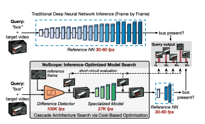

# NoScope: Optimizing Neural Network Queriesover Video at Scale

NoScope presents a set of techniques for reducing the cost of prediction serving for object detection in video streams.

### Motivation

The cost of video data acquisition is dropping as cameras get cheaper, while state-of-the-art NNs continue to get deeper and more costly to evaluate, resulting in a three order-of-magnitude imbalance between the cost of data acquisition and the cost of data processing. For example, applying a state-of-the-art object detector in real-time \(i.e., 30+ frames per second\) to a single video requires a $4000 GPU.

### Overview

NoScope targets binary classification queries on fixed-location cameras. Users input queries to identify the periods of time in which a particular object is visible in the video. 

> NoScope’s goal is to produce the same classification output as applying the target model on all frames of the video, at a substantially lower computational cost and while staying within the specified accuracy target.

The paper presents two techniques\(_model specialization and difference detection_\) used in combination to reduce the number of frames that require a state-of-the-art model for accurate classification. 

#### Model specialization

The authors observe that generic NNs can classify or detect thousands of classes\(9000 classes in YOLO9000\), but the generality of these models naturally leads to costly inference. In contrast, one can use historical video data for the specific camera feed being queried to train a much smaller, specialized model for the query. 

These specialized NN can output a confidence value c that, if pass the specified thresholds, let NoScope safely label the frame without consulting the reference NN. For output value between the thresholds, NoScope calls the full reference NN on the frame. 

#### Difference Detection

Videos contain a high degree of temporal locality, especially those from fixed-angle cameras. To leverage this temporal locality, if the difference detectors find that the current frame is similar enough to an existing frame that has already been labeled, NoScope skips inference completely and simply uses the label from the previously classified frame. Note that the existing labeled frame could be either a fixed reference image or an earlier frame, and the difference detector computes the Mean Square Error\(MSE\) between them as a measure of distance. 

One of the key challenges in combining two techniques is that the optimal choice of the cascade is video-dependent. NoScope uses a cost-based optimizer to select the optimal deployment for a particular video stream, query, and model from the set of possible specialized model architectures and difference detectors.

