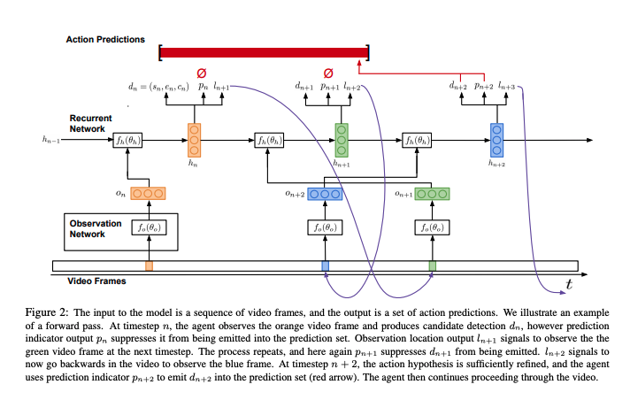

# End-to-end Learning of Action Detection from Frame Glimpses in Videos

This paper proposes a model that takes a long video as input and outputs the temporal bounds of detected action instances. The key intuition is that the process of detecting an action is one of continuous, iterative observation and refinement.

### Method

The goal is to take a long sequence of video and output any instance of a given action. The authors formulate this model as an RL agent interacts with a video over time. 

The model consists of two main components: an observation network and a recurrent network. 

* **Observation network**: It encodes the frame into a feature vector $$O_n$$ and provides this as input to the recurrent network. $$O_n$$ encodes timestamp of video and what was seen. 
* **Recurrent network**: As the agent reasons on a video, three outputs are produced at each timestep: candidate detection $$d_n$$, binary indicator $$p_n$$ signaling whether to emit $$d_n$$ as a prediction, and temporal location $$l_{n+1}$$ indicating the frame to observe next \(NOTE: the agent may skip both forwards and backward around a video\). Candidate detection is a tuple of \(start time, end time, confience level\). 

The candidate detection $$d_n$$is trained with backpropagation and $$p_n$$and $$l_{n+1}$$ are trained with REINFORCE. 

### Evaluation

The model is evaluated on THUSMOS'14 and ActivityNet. The result shows that their approach outperforms state-of-the-art results while observing in total only 2% or less of the video frames.

